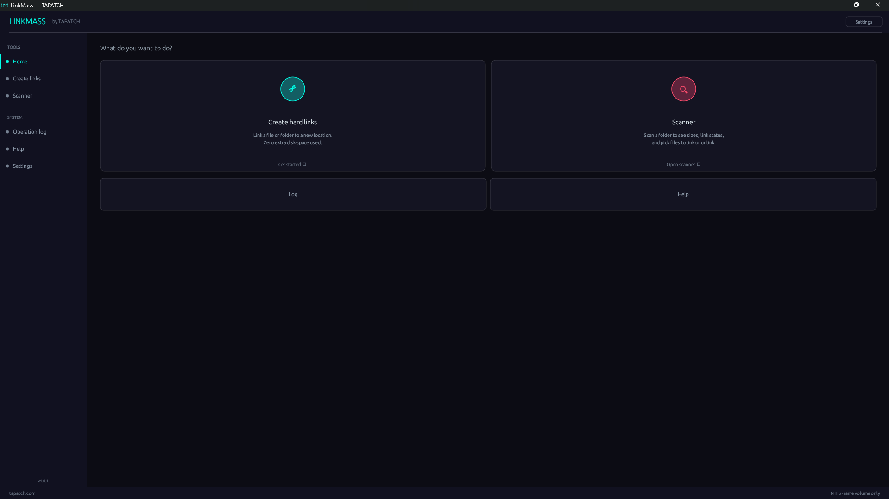

<p align="center"></p>
<h1 align="center">LinkMass</h1>
<p align="center"><b>Shrink your drive. Zero wasted space.</b></p>
<p align="center">Storage Optimizer · Windows 10/11 · x64 · ~4 MB · Free for personal use</p>
<p align="center"><a href="https://github.com/tapatchUSA/LinkMass/releases/latest"><b>⬇ Download LinkMass 1.0.3</b></a> &nbsp;·&nbsp; <a href="https://tapatch.com/tools/linkmass/">tapatch.com/tools/linkmass</a></p>

<p align="center">

</p>

> Built because Windows never gave you a real hard link manager. Hard links have always been there — just buried. LinkMass digs them out.

## What it does

LinkMass is the hard link manager Windows never built in. Create links, hunt duplicates, scan folder trees, and break links safely — all from a polished, theme-able GUI. No command line required. Works entirely locally with no network access.

[](https://www.youtube.com/watch?v=lGmgFCfLwrQ)

## Features

Loaded with custom-built functionality. Too much to put on a page — here are the main ones.

**⛓ Create hard links**  
Link files to new locations with zero extra disk usage. Single file, flat folder, or full recursive mirror — your choice.

**♻️ Find duplicates**  
Scan for duplicate files and convert them to hard links automatically. Recover gigabytes without moving or deleting anything.

**🔍 Directory scanner**  
Browse any folder tree with live link counts, file sizes, and status badges. Unlink individual files in a single click.

**✂️ Remove links**  
Safely breaks hard links using a copy-delete-rename approach. Files remain fully usable throughout the whole operation.

**🎨 7 themes + custom**  
TAPATCH, VOID, NEON, EMBER, ARCTIC, FOREST, and SLATE built in. Custom mode lets you set any colour with a live preview.

**🧪 Dry-run mode**  
Runs the full operation logic but touches nothing on disk. Every planned action is logged before you commit.

## Limitations

- Hard links only work within the same drive volume. Directories cannot be hard-linked — LinkMass recreates the folder structure and links each file individually. Requires NTFS. FAT32 and exFAT are not supported.

## What's new in 1.0.3

- Now in 10 languages: English, Chinese (Simplified), Russian, Spanish, Portuguese, German, Japanese, French, Polish and Korean
- Starts in your Windows language (English if yours isn't one of the 10). The first launch asks which language you want, and you can switch any time inside the app
- The installer comes in the same 10 languages
- The Terms of Service are shown translated for convenience, with the official English (US) text, the only binding version, right below

Release notes for every version are on the [Releases](https://github.com/tapatchUSA/LinkMass/releases) page.

## Install

1. Download **LinkMass-Setup-1.0.3.exe** from the [latest release](https://github.com/tapatchUSA/LinkMass/releases/latest) or from [tapatch.com](https://tapatch.com/tools/linkmass/).
2. Run it. The installer and the app come in 10 languages.
3. Accept the Terms of Service on first launch.

Windows may show a SmartScreen warning for new downloads. Click **More info → Run anyway**.

Or with [Scoop](https://scoop.sh):

```powershell
scoop bucket add tapatch https://github.com/tapatchUSA/packages
scoop install tapatch/linkmass
```

## All versions

| Version | Released | Installer | VirusTotal | SHA-256 |
|---|---|---|---|---|
| [1.0.3](https://github.com/tapatchUSA/LinkMass/releases/tag/v1.0.3) | 2026-10-01 | [LinkMass-Setup-1.0.3.exe](https://github.com/tapatchUSA/LinkMass/releases/download/v1.0.3/LinkMass-Setup-1.0.3.exe) | [1 / 70](https://www.virustotal.com/gui/file/b072a6049b5a7968609924cdf35f05ae3931102067cddc8eea6e4ef8aa6dbbbd/detection) | `b072a6049b5a7968…` |
| [1.0.2](https://github.com/tapatchUSA/LinkMass/releases/tag/v1.0.2) | 2026-09-30 | [LinkMass-Setup-1.0.2.exe](https://github.com/tapatchUSA/LinkMass/releases/download/v1.0.2/LinkMass-Setup-1.0.2.exe) | [1 / 71](https://www.virustotal.com/gui/file/cad234e48690c41fca683a0f0aaf79a5ff23ef88bd0ae9c1480e9214e0132113/detection) | `cad234e48690c41f…` |
| [1.0.1](https://github.com/tapatchUSA/LinkMass/releases/tag/v1.0.1) | 2026-04-24 | [LinkMass-Setup-1.0.1.exe](https://github.com/tapatchUSA/LinkMass/releases/download/v1.0.1/LinkMass-Setup-1.0.1.exe) | [1 / 70](https://www.virustotal.com/gui/file/7147e94b1a113ae7b32f5ff1fb35bd0361f01ccdac315d352baf76ecda488eb8/detection) | `7147e94b1a113ae7…` |
| [1.0.0](https://github.com/tapatchUSA/LinkMass/releases/tag/v1.0.0) | 2026-04-11 | [LinkMass-Setup-1.0.0.exe](https://github.com/tapatchUSA/LinkMass/releases/download/v1.0.0/LinkMass-Setup-1.0.0.exe) | [1 / 72](https://www.virustotal.com/gui/file/5c1dacb4f2d46d275cc8ebf86ebc2affcff42be4e9aab9402ceca6692ed96153/detection) | `5c1dacb4f2d46d27…` |

## Security

Every installer is scanned on VirusTotal before release. LinkMass 1.0.3: **1 / 70** engines flag it · [view report](https://www.virustotal.com/gui/file/b072a6049b5a7968609924cdf35f05ae3931102067cddc8eea6e4ef8aa6dbbbd/detection)

**SHA-256**
```
b072a6049b5a7968609924cdf35f05ae3931102067cddc8eea6e4ef8aa6dbbbd
```

## Built with

Rust · egui · eframe · winapi · serde

## License

Free for personal use. Business or commercial use requires a paid license (see [tapatch.com/terms](https://tapatch.com/terms/)). Full terms: [tapatch.com/terms/software](https://tapatch.com/terms/software/).

This repository holds the official installers and release notes.

---

**[tapatch.com](https://tapatch.com)**: small tools, serious quality. Built solo, shipped with care.
