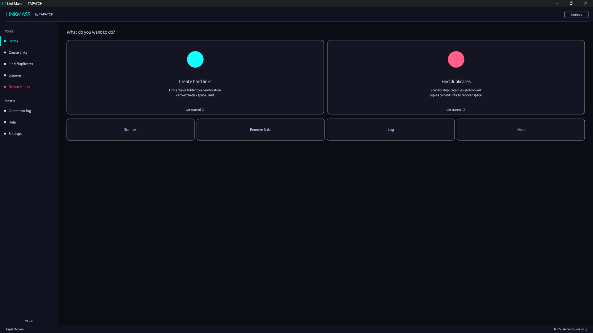

# ⛓ LinkMass

**The hard link manager Windows never built in.**

> Built because Windows never gave you a real hard link manager. Hard links have always been there — just buried. LinkMass digs them out.



---

## Download

**[⬇ Download LinkMass v1.0.0](https://tapatch.com/tools/linkmass)** — Free for personal use · Windows 10/11 · x64

| | |
|---|---|
| Version | 1.0.0 |
| Platform | Windows 10/11 |
| Architecture | x64 |
| Filesystem | NTFS only |
| Size | ~4 MB |
| Price | Free |
| License | Personal use |

---

## What it does

LinkMass is the hard link manager Windows never built in. Create links, hunt duplicates, scan folder trees, and break links safely — all from a polished, theme-able GUI. No command line required. Works entirely locally with no network access.

---

## Features

**⛓ Create hard links**
Link files to new locations with zero extra disk usage. Single file, flat folder, or full recursive mirror — your choice.

**♻️ Find duplicates**
Scan for duplicate files and convert them to hard links automatically. Recover gigabytes without moving or deleting anything.

**🔍 Directory scanner**
Browse any folder tree with live link counts, file sizes, and status badges. Unlink individual files in a single click.

**✂️ Remove links**
Safely breaks hard links using a copy-delete-rename approach. Files remain fully usable throughout the whole operation.

**🎨 7 themes + custom**
TAPATCH, VOID, NEON, EMBER, ARCTIC, FOREST, and SLATE built in. Custom mode lets you set any colour with a live preview.

**🧪 Dry-run mode**
Runs the full operation logic but touches nothing on disk. Every planned action is logged before you commit.

---

## Limitations

- Hard links only work within the same drive volume
- Directories cannot be hard-linked — LinkMass recreates the folder structure and links each file individually
- Requires NTFS — FAT32 and exFAT are not supported

---

## Changelog

### v1.0.0 — Initial release
- Create hard links — single file, flat folder, recursive mirror
- Find duplicates wizard with dry-run support
- Directory scanner with sorting, filters, and expand/collapse
- Remove links via copy-unlink method — files stay safe
- 7 built-in themes + fully customisable colour editor
- Drag-and-drop path input on all screens
- Preferences persist at `%APPDATA%\TAPATCH\LinkMass\prefs.json`

---

## Security

VirusTotal scan: **1 / 72 engines** — [View report](https://www.virustotal.com/gui/file/5c1dacb4f2d46d275cc8ebf86ebc2affcff42be4e9aab9402ceca6692ed96153/detection)

**SHA-256**
```
5c1dacb4f2d46d275cc8ebf86ebc2affcff42be4e9aab9402ceca6692ed96153
```

---

## Built with

Rust · egui · eframe · winapi · serde

---

## License

Free for personal use. See [Terms](https://tapatch.com/terms/software) for full license.

---

**[tapatch.com](https://tapatch.com)** — Small tools, serious quality. Built solo, shipped with care.
